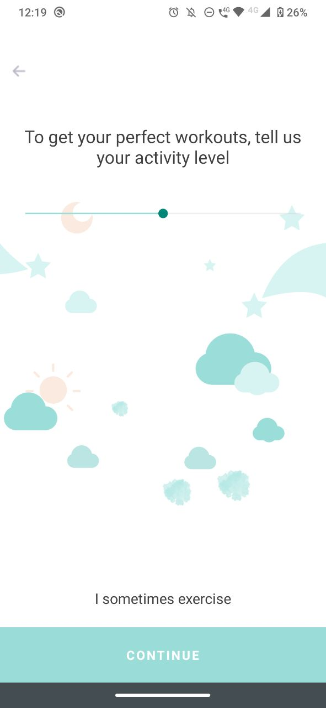
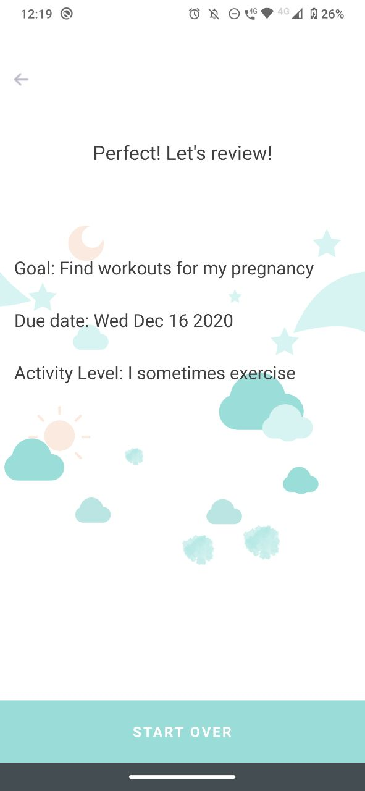

# MiniOnboarding

## About

This is a mini on-boarding application, built with React-Native and [Ignite Bowser](https://github.com/infinitered/ignite-bowser).

## Instalation

1. Make sure you have [React Native](https://reactnative.dev/) and [Yarn](https://yarnpkg.com/)

2. Install your dependencies

    ```
    cd path/to/mini-onboarding-ignite-bowser
    yarn install
    ```
   
3. Test the code

    ```
    yarn test
    ```

4. Or just the implemented model

    ```
    yarn test on-boarding-store
    ```

5. Start your app

    ```
    yarn start
    ```

6. Deploy on your device/emulator

    ```
    yarn ios/android
    ```
   
## Extra packages

1. [DatePicker](https://github.com/henninghall/react-native-date-picker)

2. [slider](https://github.com/callstack/react-native-slider)

3. [RadioButtons](https://github.com/sramezani/radio-buttons-react-native)   
   
## Screens

Below are the 4 screens for the mini on-boarding app.

      
   
## Ignite README
Currently includes:

- React Native
- React Navigation
- MobX State Tree
- TypeScript

## Quick Start

The Ignite Bowser boilerplate project's structure will look similar to this with some adaptations:

```
project
├── app
│   ├── components
│   ├── i18n
│   ├── utils
│   ├── models
│   ├── navigation
│   ├── screens
│   ├── services
│   ├── theme
│   ├── app.tsx
├── test
│   ├── __snapshots__
│   ├── storyshots.test.ts.snap
│   ├── mock-i18n.ts
│   ├── mock-reactotron.ts
│   ├── setup.ts
│   ├── storyshots.test.ts
├── README.md
├── android
│   ├── app
│   ├── build.gradle
│   ├── gradle
│   ├── gradle.properties
│   ├── gradlew
│   ├── gradlew.bat
│   ├── keystores
│   └── settings.gradle
├── ignite
│   ├── ignite.json
│   └── plugins
├── index.js
├── ios
│   ├── IgniteProject
│   ├── IgniteProject-tvOS
│   ├── IgniteProject-tvOSTests
│   ├── IgniteProject.xcodeproj
│   └── IgniteProjectTests
├── .env
└── package.json

```

### ./app directory

Included in an Ignite boilerplate project is the `app` directory. This is a directory you would normally have to create when using vanilla React Native.

The inside of the src directory looks similar to the following:

```
app
│── components
│── i18n
├── models
├── navigation
├── screens
├── services
├── theme
├── utils
└── app.tsx
```

**components**
This is where your React components will live. Each component will have a directory containing the `.tsx` file, along with a story file, and optionally `.presets`, and `.props` files for larger components. The app will come with some commonly used components like Button.

**i18n**
This is where your translations will live if you are using `react-native-i18n`.

**models**
This is where your app's models will live. Each model has a directory which will contain the `mobx-state-tree` model file, test file, and any other supporting files like actions, types, etc.

**navigation**
This is where your `react-navigation` navigators will live.

**screens**
This is where your screen components will live. A screen is a React component which will take up the entire screen and be part of the navigation hierarchy. Each screen will have a directory containing the `.tsx` file, along with any assets or other helper files.

**services**
Any services that interface with the outside world will live here (think REST APIs, Push Notifications, etc.).

**theme**
Here lives the theme for your application, including spacing, colors, and typography.

**utils**
This is a great place to put miscellaneous helpers and utilities. Things like date helpers, formatters, etc. are often found here. However, it should only be used for things that are truely shared across your application. If a helper or utility is only used by a specific component or model, consider co-locating your helper with that component or model.

**app.tsx** This is the entry point to your app. This is where you will find the main App component which renders the rest of the application. This is also where you will specify whether you want to run the app in storybook mode.

### ./ignite directory

The `ignite` directory stores all things Ignite, including CLI and boilerplate items. Here you will find generators, plugins and examples to help you get started with React Native.

### ./test directory

This directory will hold your Jest configs and mocks, as well as your [storyshots](https://github.com/storybooks/storybook/tree/master/addons/storyshots) test file. This is a file that contains the snapshots of all your component storybooks.
